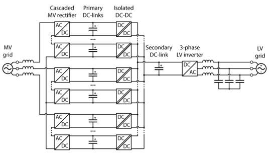

# Solid State Transformer (SST)


A comprehensive design and implementation of a Solid State Transformer for modern power electronics applications. This project provides complete design files, simulations, and documentation for building a high-efficiency, compact SST suitable for smart grid applications, renewable energy integration, and industrial power conversion systems.



## Overview

Solid State Transformers represent the next generation of power conversion technology, offering significant advantages over traditional magnetic transformers including:

- **Higher Efficiency**: Advanced semiconductor switching with minimal losses
- **Compact Design**: Reduced size and weight compared to conventional transformers
- **Smart Grid Integration**: Built-in communication and control capabilities
- **Power Quality Enhancement**: Active filtering and voltage regulation
- **Bidirectional Power Flow**: Support for renewable energy integration

## Features

- **Multi-Stage Architecture**: Optimized AC-DC-AC conversion topology
- **High-Frequency Isolation**: Compact magnetic components operating at elevated frequencies
- **Advanced Control System**: Digital signal processing for optimal performance
- **Protection Mechanisms**: Comprehensive fault detection and protection circuits
- **Modular Design**: Scalable architecture for various power ratings
- **Communication Interface**: Integration with smart grid protocols

## System Architecture

The SST design implements a three-stage conversion topology:

1. **AC-DC Rectifier Stage**: High-efficiency power factor correction
2. **DC-DC Isolation Stage**: High-frequency transformer for galvanic isolation
3. **DC-AC Inverter Stage**: Sinusoidal output with low harmonic distortion

### Key Specifications

| Parameter | Value | Unit |
|-----------|-------|------|
| Input Voltage | 400-480 | VAC (3-phase) |
| Output Voltage | 208/120 | VAC |
| Power Rating | 10-50 | kW |
| Efficiency | >95 | % |
| Switching Frequency | 20-100 | kHz |
| THD | <3 | % |

## Repository Structure

```
SolidStateTransformer/
├── PCB/                    # PCB design files and layouts
├── simulations/            # SPICE/MATLAB simulation files
├── code/                   # Python analysis and simulation code
│   ├── sst_analysis.py           # SST analysis module
│   ├── DAB_inductor_selection.py # DAB inductor selection tool
│   └── requirements.txt          # Python dependencies
├── references/             # Technical papers and design references
├── images/                 # Project images and diagrams
├── LICENSE.md             # License information
└── README.md              # This file
```

## Getting Started

### Prerequisites

- **Design Software**: Altium Designer, KiCad, or equivalent PCB design tool
- **Simulation Tools**: MATLAB/Simulink, LTspice, or PLECS
- **Programming Environment**: Python 3.7+ for analysis scripts (optional)

### Installation

1. Clone the repository:
```bash
git clone https://github.com/fulongli/SolidStateTransformer.git
cd SolidStateTransformer
```

2. Open the PCB design files in your preferred EDA tool
3. Load simulation files in MATLAB/Simulink or SPICE simulator
4. (Optional) Install Python dependencies for analysis tools:
```bash
cd code
pip install -r requirements.txt
```
5. Review the design documentation and specifications

## Simulation and Analysis

The project includes comprehensive simulation models for:

- **Power Stage Analysis**: Efficiency, losses, and thermal behavior
- **Control System Design**: Feedback loops and stability analysis
- **Harmonic Analysis**: Input/output waveform quality
- **Transient Response**: Dynamic performance under load changes

### Running Simulations

1. Navigate to the `simulations/` directory
2. Open the main simulation file in your preferred tool
3. Configure simulation parameters as needed
4. Run analysis and review results

### Python Analysis Tools

The project includes Python-based analysis tools for SST performance evaluation:

**Available Modules:**

1. **sst_analysis.py** - General SST analysis and simulation
   - Power loss calculation and breakdown
   - DC link voltage and transformer turns ratio calculation
   - Switching loss analysis
   - Harmonic distortion (THD) analysis
   - Thermal analysis
   - Power efficiency plotting

2. **DAB_inductor_selection.py** - Dual Active Bridge inductor design
   - Inductor value calculation based on power and phase shift
   - Current ripple and RMS/peak current analysis
   - Power transfer calculations
   - Loss analysis (copper and core losses)
   - Design optimization and constraint checking
   - Visualization tools for design trade-offs

**Usage:**
```bash
cd code
python sst_analysis.py
python DAB_inductor_selection.py
```

**Example - SST Analysis:**
```python
from sst_analysis import SSTAnalyzer, SSTParameters

params = SSTParameters(input_voltage=400, output_voltage=208, power_rating=10)
analyzer = SSTAnalyzer(params)
losses = analyzer.calculate_power_losses(10.0)
```

**Example - DAB Inductor Selection:**
```python
from DAB_inductor_selection import DABInductorSelector, DABParameters
import numpy as np

params = DABParameters(v1=600, v2=400, power=10, switching_frequency=50)
selector = DABInductorSelector(params)
inductor = selector.select_inductor(phase_shift=np.pi/3)
```

## Hardware Implementation

### PCB Design

The PCB design follows best practices for high-power, high-frequency applications:

- **Multi-layer stackup** for optimal thermal management
- **Dedicated power and ground planes** for low impedance paths
- **Strategic component placement** to minimize parasitic effects
- **EMI considerations** with proper shielding and filtering

### Component Selection

Key components include:
- **Power Semiconductors**: SiC MOSFETs or GaN devices for high efficiency
- **Magnetic Components**: Custom-designed high-frequency transformers
- **Control ICs**: Digital signal processors for real-time control
- **Protection Devices**: Fuses, surge suppressors, and monitoring circuits

## License

This project is licensed under the **Creative Commons Attribution 4.0 International License (CC BY 4.0)** - see the [LICENSE.md](LICENSE.md) file for details.

**Copyright © 2025 Fulong Li**

## Contact

**[Fulong Li](https://fulongli.github.io/)**

For questions, collaborations, or technical discussions:
- **Email:** fulong.li@ieee.org
- **Website:** [https://fulongli.github.io/](https://fulongli.github.io/)
- **LinkedIn:** Connect for professional discussions
- **ResearchGate:** Access to related publications

---

*This project represents ongoing research in advanced power electronics. For the latest updates and related work, please visit the author's website.*